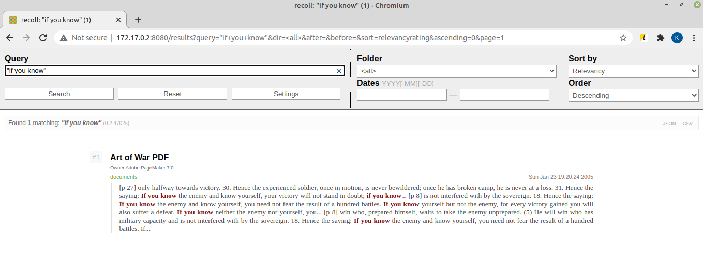

# What is this?

Recoll is nowadays a fully available OS package (Ubuntu) of a pretty fast and convenient document indexer. Problem with it is that it's mostly a CLI tool (terminal-based), and a GUI for it is written in QT - so not very portable in 2020.

I decided to put it all together and create an end-to-end web based image for it. You get a result like below, and it should even run in Kubernetes when you add some yamls:



## Why do I need this ?

You basically need this when you have a big directory of documents, pdf files, code and what not all mixed up together and want to search for keywords.

## Building this docker image

Should be as easy as invoking ```docker build -t recoll-web .``` . Then you should know what to do with it.

## Running locally

Assuming you're cd'd into a directory full of text documents you want to search through, it should be as easy as doing: ```docker run -v $(pwd):/opt/documents -p 8080:8080 recoll-web``` and then going to port 8080 of your docker container.

There's an initial full indexing pass done for the first time it runs, and after that recoll is set to monitor the docs folder you gave it every couple of moments for added documents.

## Thanks

Recoll web UI project: https://framagit.org/medoc92/recollwebui.git

Recoll itself: https://github.com/314eter/recoll

S6 overlay: https://github.com/just-containers/s6-overlay
